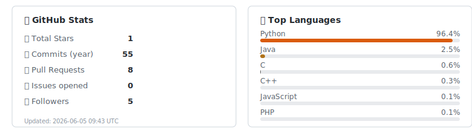

<h1 align="center">Matteo Giorgi</h1>

  <em>M.Sc. Computer Engineering · AI & Data Engineering · University of Pisa</em>

  
  
  

---

## About Me

- 🎓 **M.Sc. in Computer Engineering** with a specialization in Artificial Intelligence and Data Engineering from the University of Pisa.
- 🤖 Passionate about AI and its applications in **robotics, autonomous systems, medical diagnostics, and space exploration**.
- 🔭 Currently seeking opportunities to contribute to innovative AI projects in a collaborative, fast-paced team.
- 🧠 Deeply interested in **AI agents** — autonomous systems that perceive, reason, and act to solve complex real-world tasks.
- 📚 Continuous learner — always exploring new frameworks, research papers, and side projects.

---

## 🚀 Technology Stack

  

  

  

---

## 📊 GitHub Stats & Analytics

  

---

## 📬 Get in Touch

  
  &nbsp;
  
  &nbsp;
  
  &nbsp;
  

